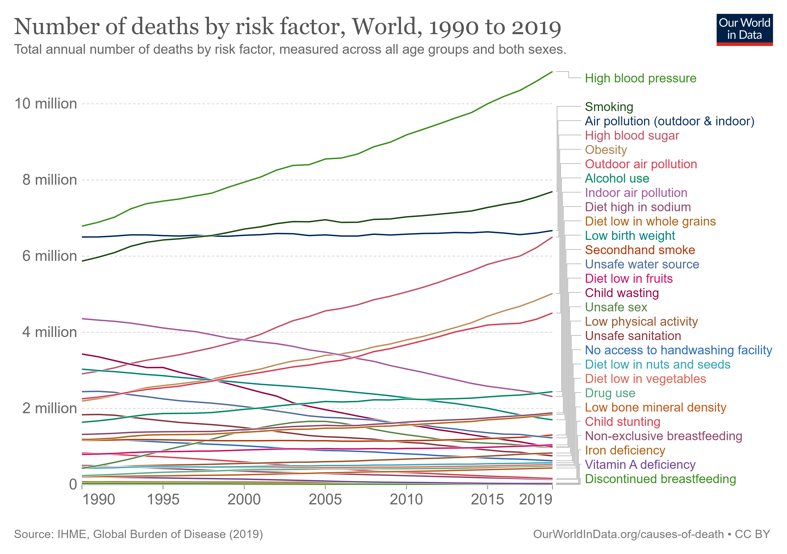
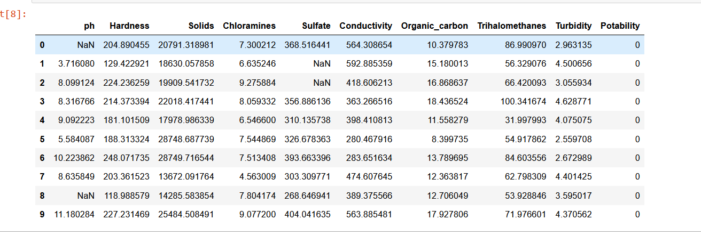
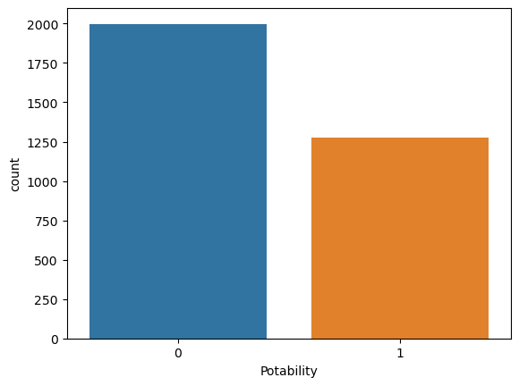
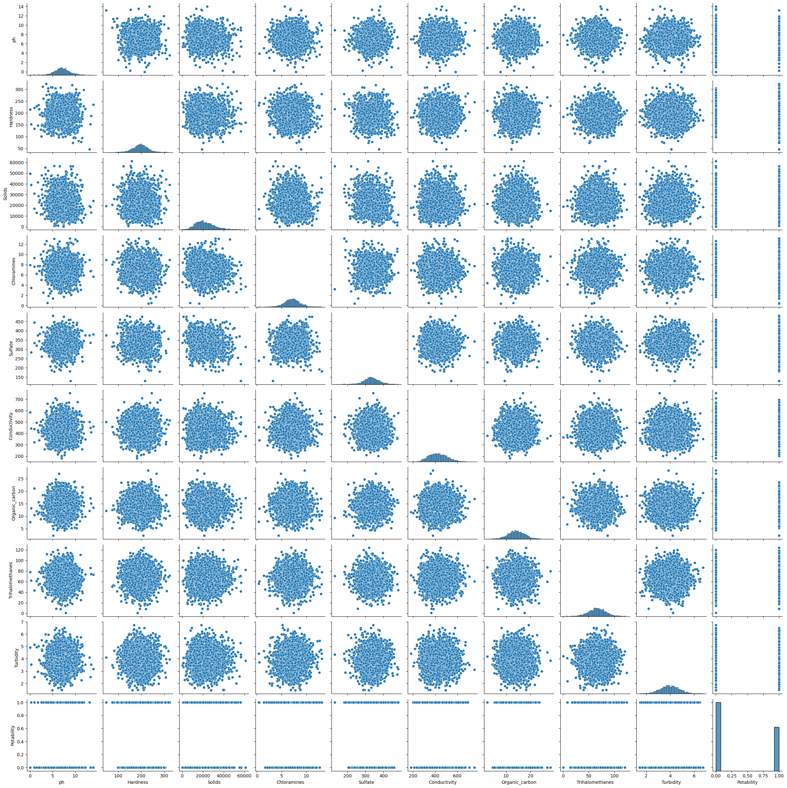
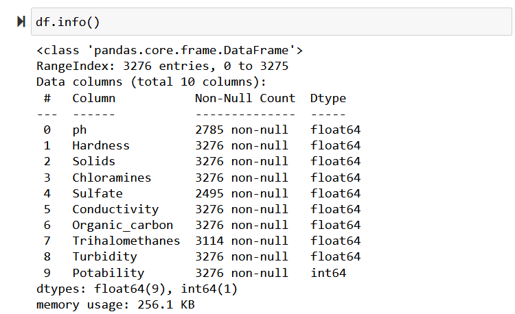
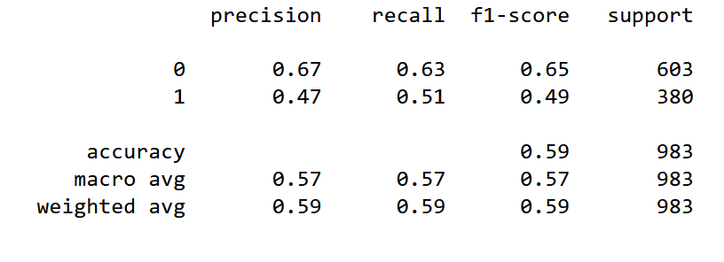

# Investigation of Water Potability

## Project Motivation

According to the *Global Burden of Disease* study 1.2 million people died prematurely as a result unsafe drinking water. This number is more than three times the amount of homicides globally and equivalent to the total amount of road deaths (1). More specifically, countries which are poorest are most vulnerable to illness from unsafe drinking water. 



It's clear that unsafe drinking water is a problem for global health. In this project, I will be exploring the inequalities of countries when it comes to water inaccesibility and also using Random Forests and Decicion Trees to predict Water Potability. 


## Predicting Water Potability with Decision Trees and Random Forests

**Where was data from**?

After reading in the data and importing the necessary libraries, this is what our data looks like. 





The data consists of 3,276 water samples and contains 9 numeric values. 

    1. pH Value 
    2. Hardness
    3. Solids
    4. Chloramines
    5. Sulfate
    6. Conductivity
    7. Organic_carbon
    8. Trihalomethanes
    9. Turbidity
    10. Potability

Potability value of 1 means potable (drinkable)and 0 not potable (undrinkable). 

Let's check the breakdown of samples that are potable vs unpotable. 




Checking for a correlation between different variables. 



There doesn't seem to be a clear correlation between any of the variables.

### Preparing our Data

Let's check for missing data. 



All the variables are numerical so we don't need to convert any of the data; however, there is quite a bit of missing data so we need to deal with those values. 


### Dealing with the missing values
 
As we can see there are a good amount of missing values that we need to deal with. Each variable has different amounts of missing values so the values appear to be missing at random. Further, some of our variables appear to be missing signficant shares of their values (3276-2785/3276 ph) and (3276-2495/3276 Sulfate) so it isn't appropriate to simply delete the rows as we would lose a great amount of our training data. 

Based off our high amount of missing values and the randomness of the values, mean imputation, median imputation, and most frequency imputation seem most appropriate. We can use each imputation method and later assess model accuracy on each set of data. 

```
df_mean = df.apply(lambda x: x.fillna(x.mean()))
df_median = df.apply(lambda x: x.fillna(x.median()))
df_mode = df.apply(lambda x: x.fillna(x.mode()))
```

My guess is that the median value will be most accurate because it better accounts for extreme values, and mode imputation tends to be better for categorical data.

### Train Test Split

```
from sklearn.model_selection import train_test_split
X = df_mean.drop('Potability',axis=1)
y = df_mean['Potability']
X_train, X_test, y_train, y_test = train_test_split(X, y, test_size=0.30, random_state=101)
```


### Decision Tree Model

```
from sklearn.tree import DecisionTreeClassifier
dtree = DecisionTreeClassifier()
dtree.fit(X_train,y_train)
```

### Predict and Evaluate Decision Tree

```
predictions = dtree.predict(X_test)
from sklearn.metrics import classification_report,confusion_matrix
print(classification_report(y_test,predictions))
```

### Interpreting Classification Report



### Data: Source? 

### Works Cited
1. https://ourworldindata.org/water-access
