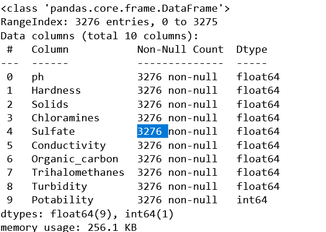
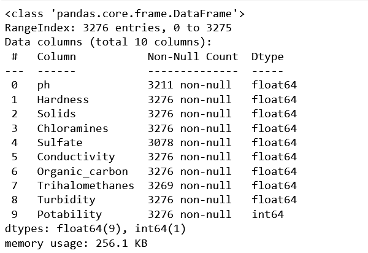
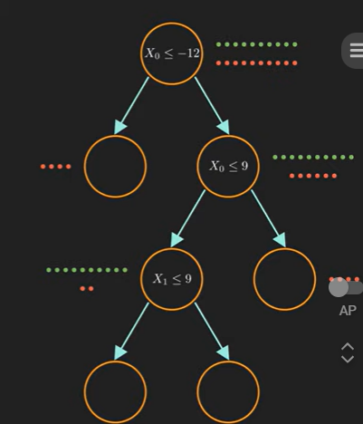
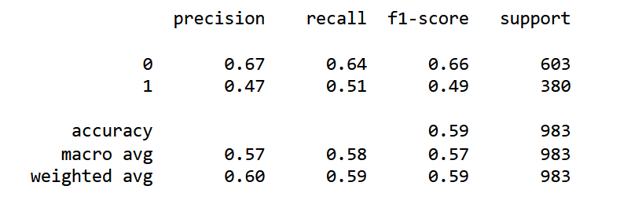

# Investigation of Water Potability

## Project Motivation

According to the *Global Burden of Disease* study 1.2 million people died prematurely as a result unsafe drinking water. This number is more than three times the amount of homicides globally and equivalent to the total amount of road deaths (1). More specifically, countries which are poorest are most vulnerable to illness from unsafe drinking water. 


It's clear that unsafe drinking water is a problem for global health. In this project, I will be exploring the inequalities of countries when it comes to water inaccesibility and also using Random Forests and Decicion Trees to predict Water Potability. 


## Predicting Water Potability with Decision Trees and Random Forests

**Where was data from**?

After reading in the data and importing the necessary libraries, this is what our data looks like. 


The data consists of 3,276 water samples and contains 9 numeric values. 

    1. pH Value 
    2. Hardness
    3. Solids
    4. Chloramines
    5. Sulfate
    6. Conductivity
    7. Organic_carbon
    8. Trihalomethanes
    9. Turbidity
    10. Potability

Potability value of 1 means potable (drinkable)and 0 not potable (undrinkable). 

Let's check the breakdown of samples that are potable vs unpotable. 


Checking for a correlation between different variables. 


There doesn't seem to be a clear correlation between any of the variables.

### Preparing our Data

Let's check for missing data. 


All the variables are numerical so we don't need to convert any of the data; however, there is quite a bit of missing data so we need to deal with those values. 


### Dealing with the missing values
 
As we can see there are a good amount of missing values that we need to deal with. Each variable has different amounts of missing values so the values appear to be missing at random. Further, some of our variables appear to be missing signficant shares of their values (3276-2785/3276 ph) and (3276-2495/3276 Sulfate) so it isn't appropriate to simply delete the rows as we would lose a great amount of our training data. 

Based off our high amount of missing values and the randomness of the values, mean imputation, median imputation, and most frequency imputation seem most appropriate. We can use each imputation method and later assess model accuracy on each set of data. 

```
df_mean = df.apply(lambda x: x.fillna(x.mean()))
df_median = df.apply(lambda x: x.fillna(x.median()))
df_mode = df.apply(lambda x: x.fillna(x.mode()))
```

After replacing all the NaN values with the respective Mean and Median of the feature the data contained no missing values as is seen below. 


My guess is that the median value will be most accurate because it better accounts for extreme values, and mode imputation tends to be better for categorical data.

### Problem with Mode Imputation


 I ran into a problem when attempting to replace all of the values with the mode (most frequent value). In many cases, there can be multiple "most frequent values", and thus there are several instances in which the mode method returns a series and not a singular value. Thus, there are still many NaN values. To avoid simply dropping these values we will not be using mode imputation and instead only rely on median and mean imputation.



In the future, we can also experiment with more advanced types of imputation methods such as **K Nearest Neighbors Imputation** or **Regression Imputation**. 

## Implementing and Evaluating Machine Learning Models

### Train Test Split

```
from sklearn.model_selection import train_test_split
X = df_mean.drop('Potability',axis=1)
y = df_mean['Potability']
X_train, X_test, y_train, y_test = train_test_split(X, y, test_size=0.30, random_state=101)
```

Here we are splitting the data into a "training" set, data which we will train our machine learning algorithm on, and a "testing" set, data which we will hold back in order to see the how accurate our model performed. 

### Decision Tree Model Theory

Decision trees can be used for both regression and classification tasks and is a form of supervised learning because it requires the data to be labeled in order to create a mode. In the case of classfication, the logical statement at each step of the decision tree is decided on which condition will maximize information gain (such as entropy or gini impurity?). This process continues recursively until all data is classified into its respective class. 

In the case of regression, we are attempting to predict a numeric value rather than classify data. Here the algorithm selects which feature will optimize variance reduction such as mean squared reduction or mean absolute error (essentially a loss function). (?) (Optimizes for loss fucntion rather than information gain?). 

**Problems with decision trees**
Decision trees are prone to overfitting. Overfitting is when a machine learning model learns from a set of training data "too well" and consequently is unable to replicate well on unseen data. Essentially, the model becomes so accurate on the training data that it is highly biased when assessing new data. Decision trees are especially prone to overfitting when there are many features in our data or if the tree grows too deep. The deeper the tree grows, the more likely overfitting will occur. Other problems that can lead to overfitting in decision trees arise from the size and distribution of our data. Overfitting can occur when our data is too small or when it's unbalanced. 

Techniques to avoid overfitting 
- pruning
- maximum tree depth
- random forests

**Random Forest Model**
In order to address the common problem of overfitting that is common with decision trees we can use a machine learning method known as random forests. 

A random forest model essentially works by creating a series of different decision trees and taking the majority decision of the trees. The process of implementing a random forest is as follows.
1. Randomly sleect a subset of the training data (with replacement) to create a bootstrapped sample. 
- In this case, "with replacement" refers to the fact that data can be resampled in multiple constructed decision trees. For example, if you have a sample of 200 data points and select a subset of 100 data points for each tree with replacement, each data point has a chance of being selected more than once. Further, it is possible that some data points will be selected multiple times while others not at all. The selection of this data is done completely at randomly and every data sample from the original has an equal chance of being selected for each new dataset. 

2. Randomly select a subset of features to consider at each split of the decision tree. How many features can be considered (?) 
3. Create a decision tree based on each bootstrapped set of data using the selected features. 

4. REPEAT PROCESS

5. To make a prediction, pass a data point into all the decision trees and take the majority vote from the trees. 

*Interesting that the term bootstrapping refers to "pull oneself up by the bootstraps" or use one's resources in order to achieve a goal. In statistics the term bootstrapping is used to refer to the idea of using the data itself to estimate its properties without assuming the underlying distribution.*


How many trees are used in a random forest? 
- it depends and there is a point of diminishing returns in which adding new trees doesn't necessarily improve the generalization performance of the model. 
- common practices
    - grid search? 
    - randomized search? 

- number of trees is a hyperparameter




### Decision Tree Model Implementation
```
from sklearn.tree import DecisionTreeClassifier
dtree = DecisionTreeClassifier()
dtree.fit(X_train,y_train)
```

#### Predict and Evaluate Decision Tree

```
predictions = dtree.predict(X_test)
from sklearn.metrics import classification_report,confusion_matrix
print(classification_report(y_test,predictions))
```

#### Interpreting Classification Reports

##### df_mean


##### df_median



**Classification report values**

Precision: Precision measures what percent of predicted true values of a particular class are indeed true. In this case for class 0, the precision is 0.68 which means that 68% of the instances the model predicted to be as class 0 (water not potable) are indeed class class 0 instances. 

Recall: (True Postitive Rate) 


**Recall** also known as the sensitivity or true positive rate, calculates the percentage of true positive instances which are correctly by the model. In the case of Random Forest (median imputation), the model correctly identified 89% of actual instances belonging to class 0, while only recalling 34% of of actual instances of class 1. *(Why such a large disparity)*

**F-1 Score:** F-1-score is the harmonic mean of precision and recall metrics. Harmonic means are useful for addressing imbalance and give more value to smaller values, thus reducing the impact of outliers. In this case we want to balance precision and recall, and thus, use the harmonic mean. 

**Support:** Support metric is simply the number of instances we have in our data set of each class. 

**Accuracy:** Accuracy calculates the model's predictions regardless of the class. Thus, an accuracy value of 0.68 means that 68% of all instances of all instances were correctly classified. 

**Macro Avg:** Macro Avg calculates the average precision, recall and F-1 score across classes. 

**Weighted Avg:** Weighted Avg calculates the weighted average of precision, recall and F-1 considering the support (number of instances of each class). 


              precision    recall  f1-score   support

           0       0.69      0.90      0.78       603
           1       0.69      0.36      0.47       380

    accuracy                           0.69       983
   macro avg       0.69      0.63      0.63       983
weighted avg       0.69      0.69      0.66       983

print(confusion_matrix(y_test,predictions))

[[542  61]
 [243 137]]

**Precision**

Class 0: 542 / (542 + 243) = 0.69
Actual 0's / Total Predicted 0's

Class 1: 137 / (137 + 69) = 
Actual 1's / Total Predicted 1's

**Recall**

Class 0: 542 / 603 = 0.90
Correctly predicted 0's / Total 0's

Class 1: 137/380 = 0.36
Correctly predicted 1's / Total 1's


### Data: Source? 

### Works Cited
1. https://ourworldindata.org/water-access


